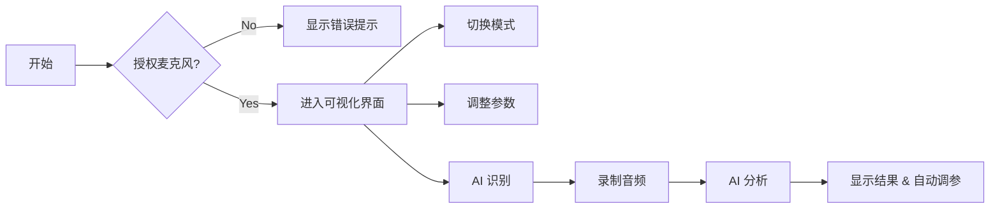

# Aura Flux - 用户操作指南

## 1. 快速入门

### 1.1 启动应用
1. 打开浏览器，访问应用地址 (e.g., `https://aura.ewuse.com` 或本地 `http://localhost:3000`)。
2. **授权许可**: 首次访问时，浏览器会请求 **麦克风权限**。请点击 "允许" (Allow)，这是音频可视化的必要条件。

### 1.2 界面概览
- **中央区域**: 3D 视觉展示区。
- **底部栏**: 播放控制与状态显示。
- **右侧面板**: 设置与 AI 功能区 (鼠标悬停或点击图标展开)。

## 2. 核心功能操作

### 2.1 切换视觉模式
1. 打开右侧 **Visual Settings** (眼睛图标) 面板。
2. 在 **Mode** 下拉菜单中选择：
   - **Silk Wave**: 柔和波浪。
   - **Neon City**: 赛博朋克城市。
   - **Cosmic Void**: 深空粒子。
   - **Vortex**: 强力漩涡。
3. 效果即时生效。

### 2.2 调整视觉参数
在 **Visual Settings** 面板中：
- **Sensitivity**: 调整对声音的敏感度。数值越高，画面跳动越剧烈。
- **Speed**: 调整动画播放速度。
- **Quality**: 调整渲染画质 (Low/Med/High)，低配设备建议选择 Low。
- **Color Theme**: 选择预设配色方案 (如 Cyberpunk, Sunset, Ocean)。
- **Cycle Colors**: 开启后自动循环切换配色方案。

### 2.3 使用 AI 识别与分析
1. 打开右侧 **AI Assistant** (机器人图标) 面板。
2. 点击 **Identify Song** 按钮。
3. 系统将录制 5-10 秒音频，并发送给 Gemini AI。
4. 识别成功后，显示歌曲信息、歌词，并自动调整视觉参数以匹配歌曲情感。

### 2.4 录制与导出
1. 点击底部控制栏的 **Record** (圆点) 按钮开始录制。
2. 再次点击停止录制。
3. 录制完成后，会自动弹出下载对话框，保存为 `.webm` 视频文件。

## 3. 常见操作流程图

## 4. 快捷键说明

| 按键 | 功能 |
| :--- | :--- |
| `Space` | 暂停/恢复可视化动画 |
| `F` | 切换全屏模式 |
| `H` | 隐藏/显示 UI 界面 (沉浸模式) |
| `R` | 重置所有参数为默认值 |

## 5. 角色权限说明

本项目为单用户客户端应用，无复杂角色系统。
- **访客 (Guest)**: 拥有所有功能权限 (可视化、AI 识别、配置调整)。
- **开发者 (Dev)**: 可访问源码进行二次开发，修改 `metadata.json` 配置。
