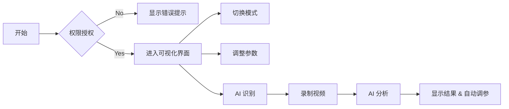

<!-- openspec/14_user_guide.md v2.3.5 -->
# Aura Flux - 用户操作指南

## 版本信息
- **版本**: v2.3.5
- **更新日期**: 2026-04-21
- **作者**: Sut

## 1. 快速入门

### 1.1 启动应用
1. 打开浏览器，访问应用地址 (e.g., `https://aura.ewuse.com` 或本地 `http://localhost:3000`)。
2. **权限授权**: 首次访问时，浏览器会请求 **麦克风权限**。请点击 "允许" (Allow)，这是音频可视化的必要条件。

### 1.2 界面概览
- **中央区域**: 3D 可视化显示区域。
- **底部栏**: 播放控制与状态显示。
- **右侧面板**: 设置与 AI 功能区 (鼠标悬停或点击图标展开)。

## 2. 核心功能操作

### 2.1 切换可视化模式
1. 打开右侧 **Visual Settings** (眼睛图标) 面板。
2. 在 **Mode** 下拉菜单中选择：
   - **Silk Wave**: 柔和波浪。
   - **Neon City**: 霓虹赛博城市。
   - **Cosmic Void**: 宇宙粒子。
   - **Vortex**: 引力漩涡。
3. 效果即时生效。

### 2.2 调整可视化参数
在 **Visual Settings** 面板中：
- **Sensitivity**: 调整对音乐的敏感度。数值越高，画面跳动越剧烈。
- **Speed**: 调整动画播放速度。
- **Quality**: 调整渲染质量 (Low/Med/High)，低配置设备建议选择 Low。
- **Color Theme**: 选择预设配色方案 (如 Cyberpunk, Sunset, Ocean)。
- **Cycle Colors**: 开启后自动循环切换配色方案。

### 2.3 使用 AI 识别与分析
1. 打开右侧 **AI Assistant** (机器人图标) 面板。
2. 点击 **Identify Song** 按钮。
3. 系统会录制 5-10 秒音频，并发送给 Gemini AI。
4. 识别成功后，显示歌曲信息、歌词，并自动调整可视化参数以匹配歌曲情感。

### 2.4 录制与导出
1. 点击底部控制栏的 **Record** (圆点) 按钮开始录制。
2. 再次点击停止录制。
3. 录制完成后，会自动弹出下载对话框，保存为 `.webm` 视频文件。

## 3. 常见操作流程图

## 4. 快捷键说明

| 按键 | 功能 |
| :--- | :--- |
| `Space` | 暂停/恢复可视化动画 |
| `F` | 切换全屏模式 |
| `H` | 隐藏/显示 UI 界面 (沉浸模式) |
| `R` | 重置所有参数为默认值 |

## 5. 权限说明

本项目为单用户客户端应用，无复杂权限系统。
- **访客 (Guest)**: 拥有所有功能权限 (可视化、AI 识别、参数调整)。
- **开发者 (Dev)**: 可查看源码进行二次开发，修改 `metadata.json` 配置。

## 6. 音频源选择

### 6.1 麦克风输入
1. 打开 **Audio Input** (麦克风图标) 面板。
2. 在 **Source** 下拉菜单中选择 "Microphone"。
3. 在 **Device** 下拉菜单中选择具体的麦克风设备。
4. 点击 **Start Listening** 按钮开始采集音频。

### 6.2 本地文件
1. 打开 **Audio Input** (麦克风图标) 面板。
2. 在 **Source** 下拉菜单中选择 "File"。
3. 点击 **Select File** 按钮选择本地音频文件。
4. 使用底部控制栏播放、暂停、调整进度。

### 6.3 网络 URL
1. 打开 **Audio Input** (麦克风图标) 面板。
2. 在 **Source** 下拉菜单中选择 "URL"。
3. 在输入框中粘贴音频文件的 URL。
4. 点击 **Load URL** 按钮加载音频。

## 7. 自定义文本

### 7.1 添加自定义文本
1. 打开 **Custom Text** (文本图标) 面板。
2. 在 **Text** 输入框中输入想要显示的文本。
3. 调整 **Size**、**Opacity**、**Position** 等参数。
4. 开启 **Enable Custom Text** 开关。

### 7.2 文本动画
1. 在 **Custom Text** 面板中，选择 **Animation** 下拉菜单。
2. 选择动画效果 (如 Fade, Slide, Bounce)。
3. 调整 **Animation Speed** 控制动画速度。

## 8. 工作室功能

### 8.1 录制设置
1. 打开 **Studio** (工作室图标) 面板。
2. 选择 **Output Format** (WebM, MP4)。
3. 选择 **Quality** (Low, Medium, High)。
4. 选择 **Duration** (手动停止或预设时长)。

### 8.2 预览功能
1. 在 **Studio** 面板中，点击 **Preview** 按钮。
2. 系统会生成一个短预览视频，展示当前可视化效果。
3. 预览完成后，点击 **Download Preview** 下载预览视频。

## 9. 系统设置

### 9.1 语言设置
1. 打开 **System** (设置图标) 面板。
2. 在 **Language** 下拉菜单中选择语言。
3. 语言会立即生效，无需刷新页面。

### 9.2 地区设置
1. 在 **System** 面板中，在 **Region** 下拉菜单中选择地区。
2. 地区设置会影响日期格式、货币符号等。

### 9.3 性能设置
1. 在 **System** 面板中，选择 **Performance Mode** (Balanced, Performance, Power Save)。
2. **Balanced**: 平衡性能与质量。
3. **Performance**: 优先考虑性能，适合低配置设备。
4. **Power Save**: 省电模式，适合移动设备。

## 10. 故障排除

### 10.1 麦克风权限问题
- **问题**: 无法获取麦克风权限。
- **解决方法**: 在浏览器地址栏左侧的锁图标中，检查并允许麦克风权限。

### 10.2 音频识别失败
- **问题**: AI 无法识别歌曲。
- **解决方法**: 确保环境安静，录制时间足够长 (5-10秒)，歌曲清晰可辨。

### 10.3 性能问题
- **问题**: 可视化效果卡顿。
- **解决方法**: 降低渲染质量 (Quality)，关闭不必要的效果，或选择性能模式。

### 10.4 录制失败
- **问题**: 无法录制或导出视频。
- **解决方法**: 检查浏览器是否支持 MediaRecorder API，确保存储空间充足。

## 11. 常见问题

### 11.1 Q: 为什么需要麦克风权限？
A: 麦克风权限是音频可视化的必要条件，即使您使用本地文件或 URL 作为音频源，系统也需要通过麦克风 API 处理音频数据。

### 11.2 Q: 音频数据会被上传吗？
A: 不会。所有音频分析都在本地客户端完成，只有在使用 AI 歌曲识别功能时，才会将短音频片段发送给 Google Gemini API。

### 11.3 Q: 支持哪些浏览器？
A: 支持所有现代浏览器，包括 Chrome, Firefox, Safari, Edge。推荐使用 Chrome 获得最佳体验。

### 11.4 Q: 可以在移动设备上使用吗？
A: 可以，Aura Flux 支持响应式设计，可在 iOS 和 Android 设备上使用。但由于移动设备性能限制，可能需要降低渲染质量。

## 12. 联系与支持

- **官方网站**: https://aura.ewuse.com
- **GitHub**: https://github.com/sutchan/aura-flux
- **Discord**: https://discord.gg/auraflux
- **支持邮箱**: support@ewuse.com